# CodeReader

**在手机上高效阅读 Python 代码** — 一款专为代码审阅设计的 Web 应用，通过 AST 分析自动解析函数调用关系，结合 AI 辅助解读，让你随时随地深入理解代码逻辑。

> 厌倦了在手机上用 GitHub 看代码时的糟糕体验？CodeReader 为移动端量身打造，同时完美适配 PC 端，让代码阅读不再是桌面专属。

---

## 界面预览

### PC 端

<table>
  <tr>
    <td><b>项目首页</b></td>
    <td><b>函数浏览器</b></td>
  </tr>
  <tr>
    <td>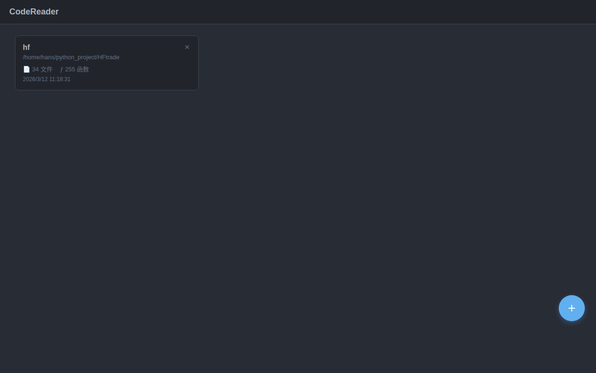</td>
    <td>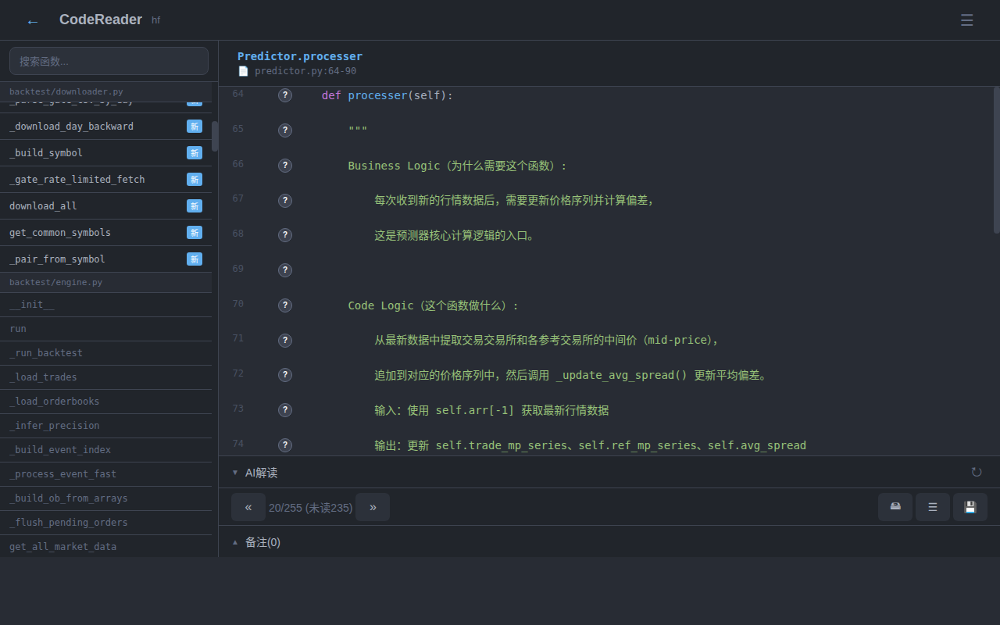</td>
  </tr>
  <tr>
    <td><b>调用关系图</b></td>
    <td><b>导出阅后记录</b></td>
  </tr>
  <tr>
    <td>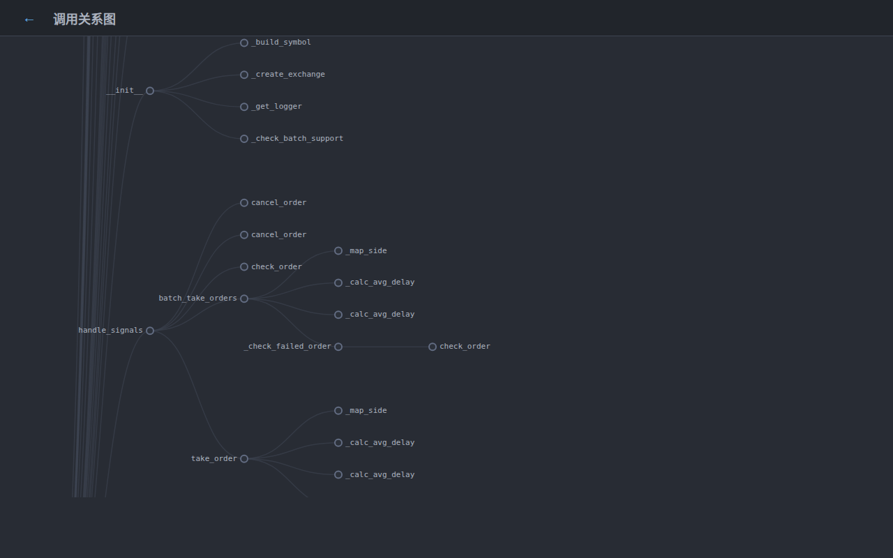</td>
    <td>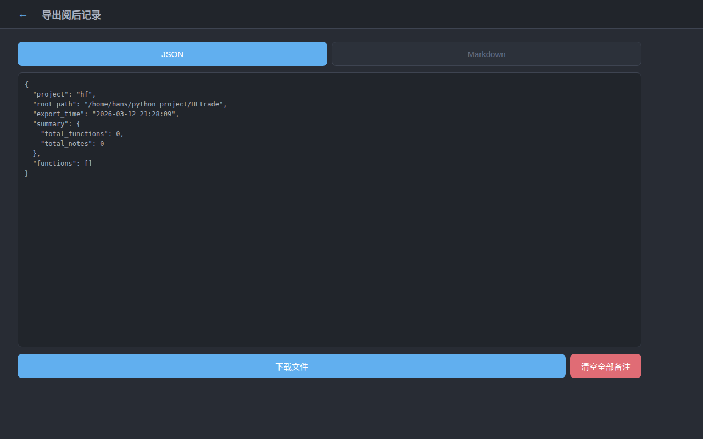</td>
  </tr>
  <tr>
    <td><b>行级调用展开 f(N)</b></td>
    <td><b>行级 AI 解释</b></td>
  </tr>
  <tr>
    <td>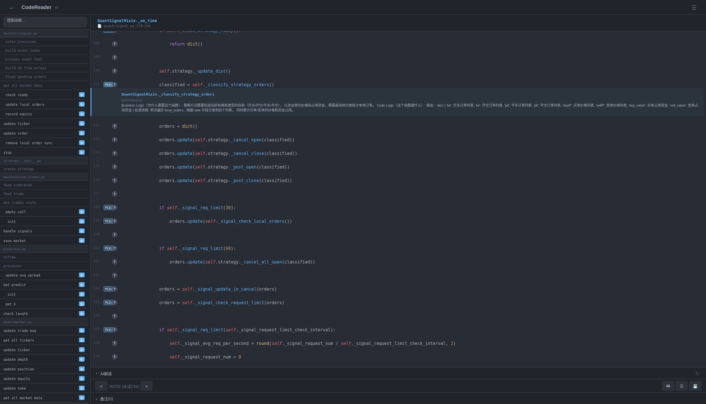</td>
    <td>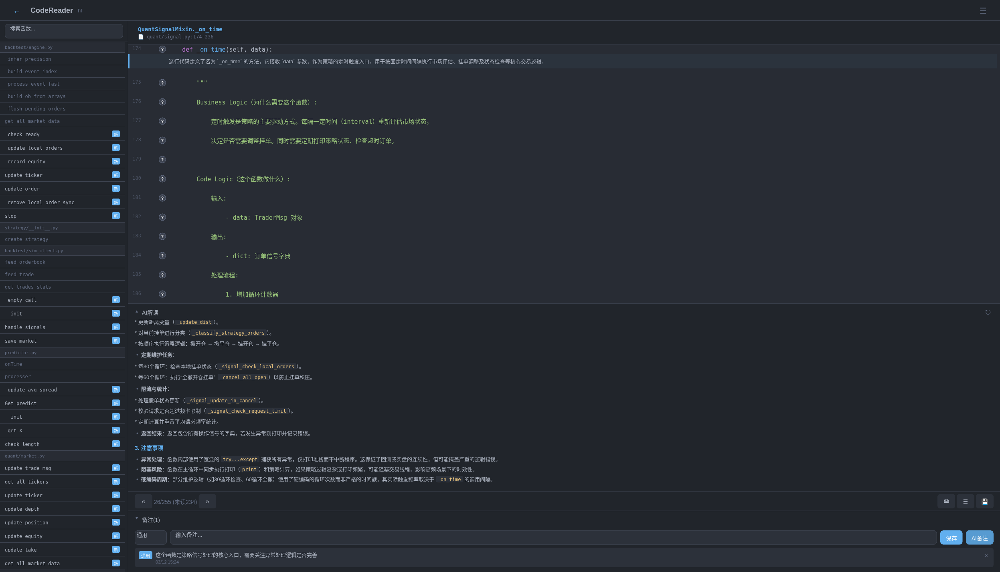</td>
  </tr>
  <tr>
    <td><b>AI 解读 + 阅后备注</b></td>
    <td><b>AI 函数解读面板</b></td>
  </tr>
  <tr>
    <td>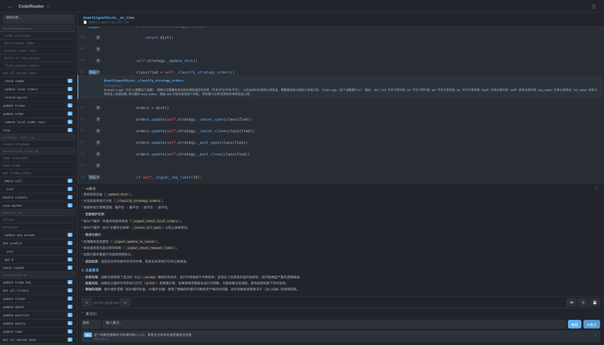</td>
    <td>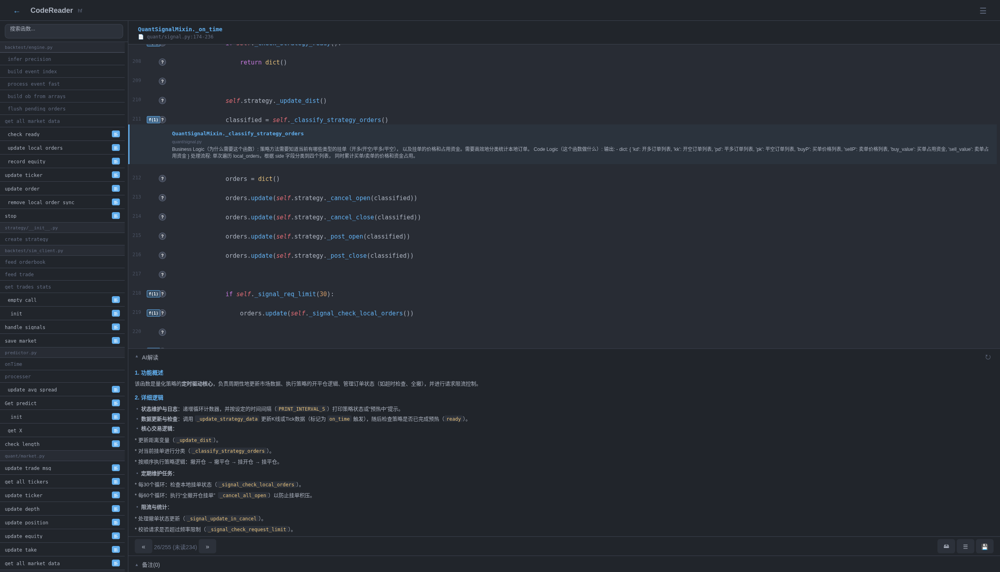</td>
  </tr>
  <tr>
    <td><b>AI 对话</b></td>
    <td><b>AI 阅读路径</b></td>
  </tr>
  <tr>
    <td>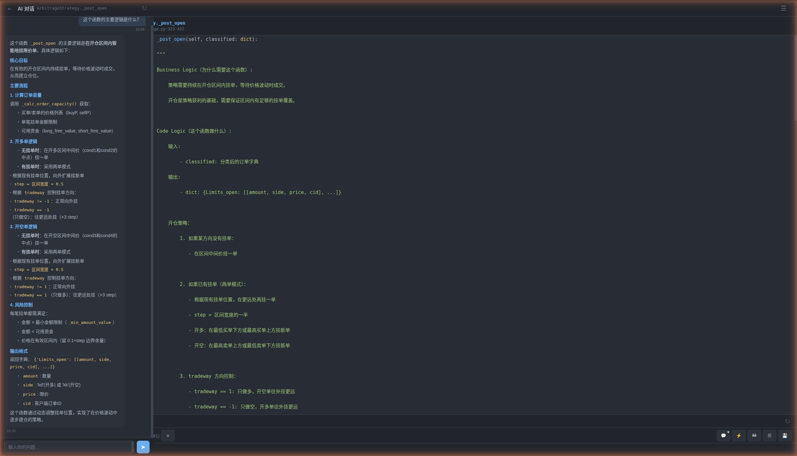</td>
    <td>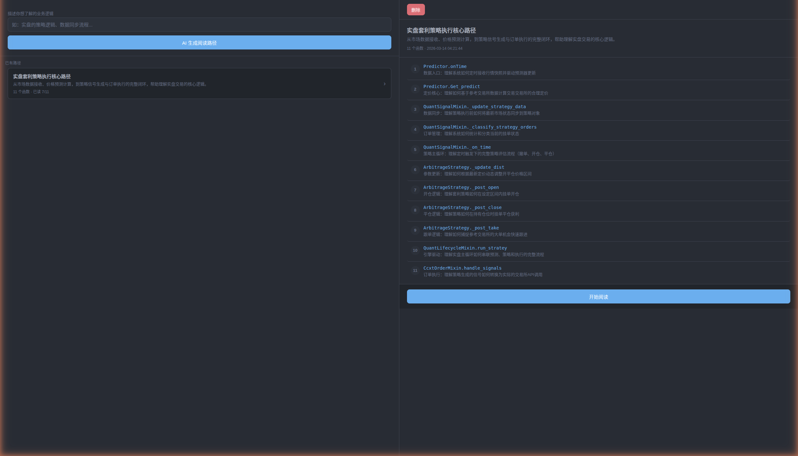</td>
  </tr>
</table>

### 移动端

<table>
  <tr>
    <td><b>项目首页</b></td>
    <td><b>函数浏览器</b></td>
    <td><b>调用关系图</b></td>
  </tr>
  <tr>
    <td></td>
    <td>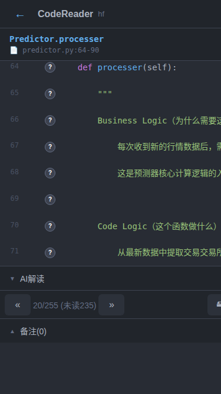</td>
    <td>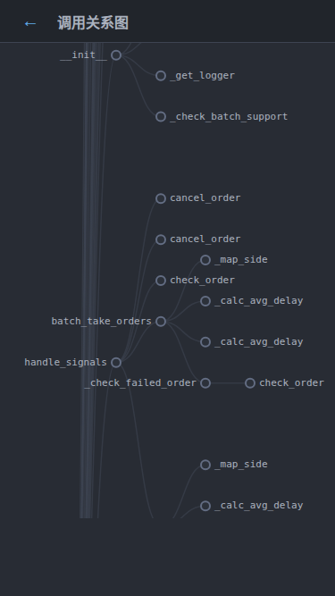</td>
  </tr>
  <tr>
    <td><b>AI 阅读路径</b></td>
    <td><b>AI 对话</b></td>
    <td></td>
  </tr>
  <tr>
    <td>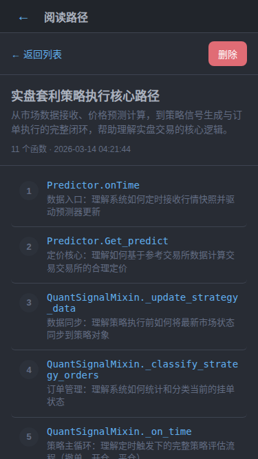</td>
    <td>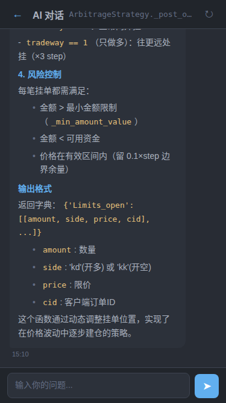</td>
    <td></td>
  </tr>
</table>

---

## 为什么用 CodeReader？

- **移动优先** — 触屏友好的左右切换浏览，告别桌面依赖
- **按调用链阅读** — 不是逐文件看代码，而是沿着函数调用关系从入口到细节，真正理解执行流程
- **AI 加持** — 函数解读、行级解释、智能对话、自动生成阅读路径，全方位 AI 辅助
- **阅读进度追踪** — 自动标记已读函数，筛选未读内容，AI 阅读路径引导你按主题高效阅读
- **结构化导出** — 把你的阅读笔记导出为 JSON/Markdown，直接喂给 AI 做进一步分析

---

## 功能详解

### 1. 项目扫描

输入 Python 项目的目录路径，CodeReader 会：
- 递归扫描所有 `.py` 文件
- 使用 AST 解析提取每一个函数/方法定义
- 分析函数间的调用关系，构建调用图
- 按调用链排序：从入口函数开始，DFS 遍历整棵调用树

### 2. 函数浏览器

核心阅读界面，支持：
- **左右切换** — 按调用关系排序的函数序列，上一个/下一个快速切换
- **语法高亮** — highlight.js 驱动的代码着色
- **行级调用标记** — 每行代码旁的 `f(N)` 按钮，展示该行调用了哪些项目内函数（含函数签名和 docstring），点击可直接跳转到被调用函数
- **行级解释** — 每行右侧的 `?` 按钮，AI 实时解释该行代码含义
- **已读状态** — 浏览过的函数自动标记，支持筛选未读/有备注函数
- **PC 端侧边栏** — 宽屏下左侧显示完整函数列表，按文件分组，搜索过滤，点击直达

### 3. AI 辅助阅读

- **函数级解读** — 可折叠面板，一键生成函数的业务逻辑分析、代码逻辑摘要、输入输出说明
- **智能缓存** — 按函数体 SHA256 哈希缓存，函数未变则复用，变了自动失效重新生成
- **预加载** — 浏览当前函数时自动预加载相邻函数的 AI 解读
- **AI 自动备注** — 一键让 AI 生成结构化备注

### 4. 调用关系图

- D3.js 绘制的横向树状图，直观展示函数调用层级
- 节点可点击，直接跳转到对应函数的代码浏览页面
- 支持缩放和拖拽

### 5. 阅后备注

- 为每个函数添加备注，支持 5 种类型标签：通用 / Bug / TODO / 重构 / 疑问
- 持久化存储在 SQLite 中
- 重新扫描项目时通过函数限定名自动保留和重新绑定备注

### 6. AI 对话

- **函数级对话** — 针对当前正在阅读的函数，向 AI 提问任何问题
- **工具增强** — AI 可自动调用工具查阅项目源码（读取文件、搜索函数、查询调用关系），回答基于实际代码而非猜测
- **快捷问题** — 预设常用问题模板（主要逻辑、潜在 Bug、重构建议），一键发起
- **对话持久化** — 对话记录保存在数据库中，切换函数后回来仍可继续
- **函数变更检测** — 当函数代码发生变化时自动提示，避免过时对话误导

### 7. AI 阅读路径

- **主题式阅读** — 输入你关注的业务主题（如"数据同步流程"、"订单处理逻辑"），AI 从项目所有函数中选出相关函数
- **推荐排序** — AI 按理解难度和依赖关系为函数排序，给出推荐阅读顺序和每个函数的阅读理由
- **进度跟踪** — 记录阅读进度，支持从上次中断处继续
- **多路径管理** — 可为同一项目创建多条阅读路径，从不同角度切入代码

### 8. 离线缓存（PWA）

- **下载缓存** — 在项目卡片上点击「下载离线缓存」，将项目全部数据（函数、代码、AI 解读、对话记录等）下载到浏览器 IndexedDB
- **离线浏览** — 无需服务器即可浏览已缓存项目的代码、备注、AI 解读、调用关系图
- **离线写入** — 离线时仍可标记已读、添加备注、更新进度，操作自动入队列
- **自动同步** — 网络恢复后自动回放离线操作，同步到服务端
- **PWA 安装** — 添加到手机桌面，像原生 APP 一样从桌面图标直接启动（需 HTTPS）

### 9. 导出

- 一键导出所有有备注的函数记录
- 支持 JSON 和 Markdown 两种格式
- JSON 格式面向 AI 优化：包含函数签名、完整代码、调用关系、备注等完整上下文，方便直接喂给 LLM 做进一步分析

---

## 快速开始

### 1. 安装依赖

```bash
pip install -r requirements.txt
```

### 2. 配置（可选）

```bash
cp config.example.toml config.toml
```

编辑 `config.toml`，AI 功能需要填写 API Key：

```toml
[ai]
base_url = "https://api.anthropic.com"
api_key = "sk-ant-..."
model = "claude-sonnet-4-20250514"
```

> 不配置也能启动，所有功能正常使用，仅 AI 解读/自动备注不可用。

**不想订阅 Claude API？** 你可以使用任何兼容 Anthropic API 格式的第三方服务，只需修改 `base_url` 指向对应的代理网关即可。例如 [z.ai](https://z.ai) 的 Coding 套餐提供了低成本的兼容方案：

```toml
[ai]
base_url = "https://api.z.ai"     # 替换为第三方服务地址
api_key = "your-api-key"
model = "claude-sonnet-4-20250514" # 按服务商支持的模型名填写
```

### 3. 启动

```bash
python main.py
```

- 本机访问：`http://localhost:8080`
- 手机访问：`http://{局域网IP}:8080`（确保手机和电脑在同一网络）

### 4. 启用 HTTPS + 添加到手机桌面（离线功能必需）

PWA 离线启动需要 HTTPS（Service Worker 要求）。通过 [Tailscale](https://tailscale.com/) 提供合法 HTTPS 证书：

```bash
# 确保服务器和手机都加入了同一个 Tailscale 网络
sudo tailscale serve --bg 8080
```

手机通过 `https://{机器名}.{tailnet}.ts.net/` 访问（Let's Encrypt 证书，浏览器完全信任）。

**添加到手机桌面：**
- Android Chrome：菜单(⋮) → 添加到主屏幕 / 安装应用
- iOS Safari：分享按钮(⬆) → 添加到主屏幕

安装后可从桌面图标直接启动，服务器未运行时仍可浏览已缓存的项目数据。

> 不需要离线功能？可以跳过此步，通过 HTTP 直接访问即可使用所有在线功能。

### 5. 使用流程

1. 在首页点击 `+` 按钮，输入 Python 项目的目录路径，创建并扫描项目
2. 点击项目卡片进入函数浏览器，左右切换函数阅读代码
3. 点击行旁 `f(N)` 按钮查看调用关系，`?` 按钮获取 AI 行级解释
4. 展开底部 AI 解读面板查看函数整体分析
5. 点击底部 💬 按钮打开 AI 对话，针对当前函数向 AI 提问
6. 在备注区添加阅读笔记或使用 AI 自动生成
7. 点击右上角菜单的「阅读路径」，输入关注主题让 AI 生成主题式阅读路径
8. 进入导出页面下载所有阅后记录

---

## 技术栈

| 层 | 技术 |
|---|---|
| 后端 | FastAPI + uvicorn |
| 数据库 | SQLite（标准库 sqlite3，零依赖） |
| 代码分析 | Python ast 模块 |
| AI | Anthropic Claude API（anthropic SDK） |
| 前端 | 纯 HTML/CSS/JS（无框架） |
| 代码高亮 | highlight.js |
| 调用关系图 | D3.js |

## 项目结构

```
codereader/
├── main.py                 # 应用入口，FastAPI 实例创建，GZip 压缩，Cache-Control
├── config.py               # 配置加载（读取 config.toml）
├── config.example.toml     # 配置模板
├── requirements.txt
├── app/                    # FastAPI 应用
│   ├── database.py         #   SQLite 数据库管理
│   ├── models.py           #   Pydantic 数据模型
│   ├── routers/            #   API 路由（项目/函数/备注/导出/AI）
│   └── services/           #   业务逻辑层
├── analyzer/               # Python 代码分析引擎
│   ├── scanner.py          #   文件扫描
│   ├── python_analyzer.py  #   AST 解析，提取函数定义和调用
│   ├── call_resolver.py    #   调用关系解析
│   └── engine.py           #   分析引擎入口
├── static/                 # 前端静态文件
│   ├── index.html          #   单页应用入口
│   ├── css/                #   样式（含响应式适配）
│   ├── js/                 #   业务逻辑（浏览/AI/备注/导出/调用图）
│   └── lib/                #   第三方 JS 库（highlight.js, D3.js）
└── data/                   # 运行时数据（SQLite 数据库，gitignored）
```

## 配置说明

| 段 | 配置项 | 默认值 | 说明 |
|---|---|---|---|
| `[server]` | `host` | `0.0.0.0` | 监听地址 |
| `[server]` | `port` | `8080` | 监听端口 |
| `[analysis]` | `include` | `["*.py"]` | 扫描文件模式 |
| `[analysis]` | `exclude` | *(见模板)* | 排除目录/文件模式 |
| `[ai]` | `base_url` | `https://api.anthropic.com` | Claude API 地址（支持自定义代理网关） |
| `[ai]` | `api_key` | `""` | Claude API Key |
| `[ai]` | `model` | `claude-sonnet-4-20250514` | 模型名称 |

## License

MIT
